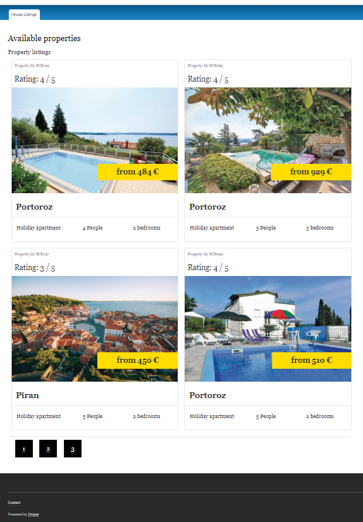

## Setup
In order to get this project up and running:

1. Download the code
2. Navigate to the folder
3. docker-compose up
4. Load in the database through the mysql container
5. composer install in /var/www/html/app/web in order to download and install Drupal Core 8
    (It is not commited in this project on purpose)
6. Navigate to localhost:8080 and the listings page will be at localhost:8080/listings

## The custom module
is located in app/web/modules/custom/´

## Database
Datbase dump is in the root of this repo (d8dump.sql)

## Screenshot of /listings page

